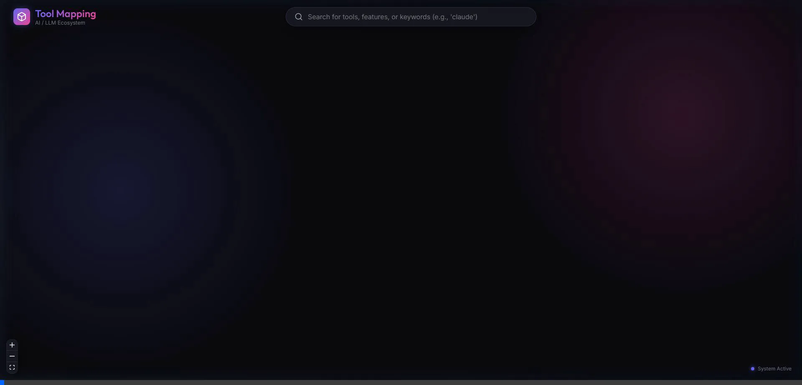
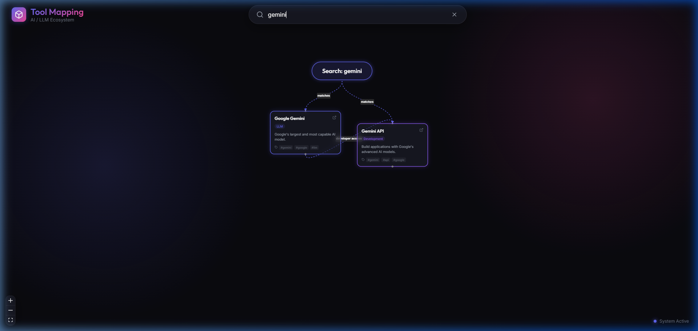

# Tool Mindmap 🌐

An interactive web application that visually maps and explores the ecosystem of AI, LLM, and Agent tools. Built with React Flow and a modern glassmorphism design.

## 🚀 Features

- **Dynamic Search & Generation**
  - Enter a keyword (e.g., `gemini`, `claude`, `agent`) to instantly generate a clean, focused mindmap tree containing only relevant tools.
- **Glassmorphism UI**
  - Stunning dark-theme design with neon accents and frosted glass effects.
- **Interactive Nodes**
  - Hover effects, tool descriptions, and direct deep-linking to GitHub repositories or official websites.

## 🎥 Demo

### Dynamic Search Generation
Watch the mindmap dynamically reconstruct itself to show an ecosystem centered around your search query:



### Search Result Overview
A clean, focused tree view showing the relationships between matched tools:



## 💻 Tech Stack

- React 18
- Vite
- React Flow
- TypeScript
- Vanilla CSS (Custom Design System)
- Lucide React (Icons)

## 🛠️ Getting Started

First, clone the repository and install the dependencies:

```bash
npm install
```

Then, run the development server:

```bash
npm run dev
```

Open [http://localhost:5175](http://localhost:5175) with your browser to see the result.

## 📁 Project Structure

- `/src/components` - React components including the core `MindMap` and `SearchBar`.
- `/src/data` - Local mock data containing the tool definitions and initial edge configurations.
- `index.css` - The core design system utilizing custom CSS variables for the glassmorphism theme.

## 📝 License

MIT
